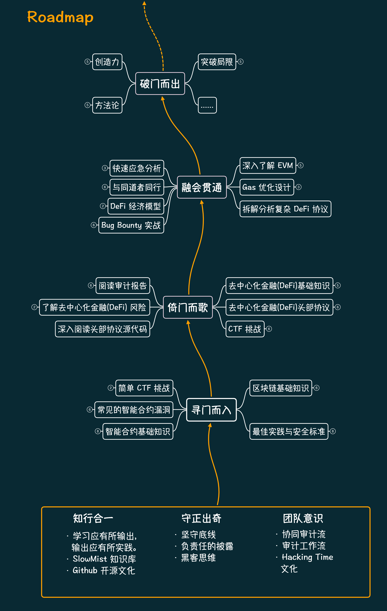

by:[ Kong'](https://twitter.com/TycheKong)@SlowMist Team

- [**前言**](#前言)
- [**路线图**](#路线图)
- [**出发准备**](#出发准备)
    - [**1. 知行合一**](#1-知行合一)
    - [**2. 守正出奇**](#2-守正出奇)
    - [**3. 团队意识**](#3-团队意识)
- [**寻门而入**](#寻门而入)
    - [**1. 区块链基础知识**](#1-区块链基础知识)
    - [**2. 智能合约基础知识**](#2-智能合约基础知识)
    - [**3. 常见的智能合约漏洞**](#3-常见的智能合约漏洞)
    - [**4. 最佳实践与安全标准**](#4-最佳实践与安全标准)
    - [**5. 简单 CTF 挑战**](#5-简单-ctf-挑战)
- [**倚门而歌**](#倚门而歌)
    - [**1. 去中心化金融(DeFi)基础知识**](#1-去中心化金融defi基础知识)
    - [**2. 去中心化金融(DeFi)头部协议**](#2-去中心化金融defi头部协议)
    - [**3. 深入阅读头部协议源代码**](#3-深入阅读头部协议源代码)
    - [**4. 了解去中心化金融(DeFi) 风险**](#4-了解去中心化金融defi-风险)
    - [**5. 阅读审计报告**](#5-阅读审计报告)
    - [**6. CTF 挑战**](#6-ctf-挑战)
- [**融会贯通**](#融会贯通)
    - [**1. 深入了解 EVM**](#1-深入了解-evm)
    - [**2. Gas 优化设计**](#2-gas-优化设计)
    - [**3. DeFi 经济模型**](#3-defi-经济模型)
    - [**4. 拆解分析复杂 DeFi 协议**](#4-拆解分析复杂-defi-协议)
    - [**5. 与同道者同行**](#5-与同道者同行)
    - [**6. 快速应急分析**](#6-快速应急分析)
    - [**7. Bug Bounty 实战**](#7-bug-bounty-实战)
- [**破门而出**](#破门而出)
    - [**1. 突破局限**](#1-突破局限)
    - [**2. 方法论**](#2-方法论)
    - [**3. 创造力**](#3-创造力)
- [**致谢**](#致谢)

## **前言**

本技能表是慢雾安全团队智能合约安全审计工程师的技能集合，旨在为团队成员列出进行智能合约审计的所需技能。并驱动团队成员形成研究、创造、工程的自我进化思维。

智能合约审计技能主要分为四个部分：寻门而入、倚门而歌、融会贯通、破门而出，分别由浅至深的列出在各个阶段所需掌握的专业技能。而在此之前首先需要一些通用技能武装我们的大脑，出发准备部分将会是我们审计之路的锚点。

## **路线图**

## **出发准备**

所谓磨刀不误砍柴功，在正式出发之前强化自己的思维是必要的，这可以使我们走得坚定、走得更远。

#### **1. 知行合一**

认知与实践是密不可分的，理论与实践应相统一。

- 学习应有所输出，输出应有所实践。
- [SlowMist 知识库](https://github.com/slowmist/Knowledge-Base)
- Github 开源文化

#### **2. 守正出奇**

道德和法律是安全从业者的底线，安全从业者在坚守底线的同时也要锻造过硬的技术，在关键时刻出奇制胜。

- 坚守底线
  - 审计人员应遵守法律，坚守道德底线。
- 负责任的披露
  - SlowMist 预警流程
  - [FIRST 道德守则](https://www.first.org/global/sigs/ethics/ethics-first)
- 黑客思维
  - 坚守底线的同时出奇制胜
  - 守正：保持敬畏，坚守底线
  - 出奇：脑洞要大，心要细，反向思维，开放性思维。

#### **3. 团队意识**

单个人的能力覆盖面总是会有所遗漏，团队战斗可以很好的补全个人的不足。

- 协同审计流
  - SlowMist MistPunk 审计工作台做协同，通过技术的方式保证审计质量，同时沉淀审计经验

- 审计工作流
  - SlowMist 审计工作流程，通过管理方式保证审计质量，同时为审计工作查缺补漏
- Hacking Time 文化
  - 团队成员随时随地的思维碰撞与分享，通过思维碰撞和分享对齐团队能力，提升团队整体能力

## **寻门而入**

加密世界发展至今其涵盖了密码学、经济学、数据科学等学科，面对知识体量极为庞大的加密世界，如何寻门而入是为关键。本阶段将从 Ethereum (以太坊) 及其智能合约语言 Solidity 开始寻找进入加密货币世界的大门。

#### **1. 区块链基础知识**

在了解智能合约是什么之前，应该先了解智能合约所运行的区块链平台是什么。

- [什么是区块链？](https://www.investopedia.com/terms/b/blockchain.asp)
- [区块链可视化演示](https://www.youtube.com/watch?v=_160oMzblY8)
- [SlowMist 区块链入门科普](https://mp.weixin.qq.com/mp/appmsgalbum?__biz=MzU4ODQ3NTM2OA==&action=getalbum&album_id=1378673890158936067&scene=126#wechat_redirect)
- [加密货币工作原理](https://www.bilibili.com/video/BV11x411i72w/)
- 阅读[《精通比特币》](https://github.com/inoutcode/bitcoin_book_2nd)
- 阅读[《精通以太坊》](https://github.com/inoutcode/ethereum_book)
  - 当前应着重阅读第 1、4、5、6、7、13 和 15 章节

#### **2. 智能合约基础知识**

在不同的区块链可能会使用不同的语言用于构建智能合约，例如：Solidity、Move、Rust、Vyper、Cairo、C++ 等。目前 EVM 兼容链使用的 Solidity 仍是最流行且易于入门的智能合约语言，应该确保完整阅读完其语言文档。且应了解运行在 Ethereum(以太坊) 上的代币合约的设计标准与具体的合约实现。在此基础上了解智能合约是如何做到可升级的，并实操掌握智能合约的编写与测试。

- [Solidity 官方文档](https://docs.soliditylang.org/en/latest/)
- 阅读[《精通以太坊》](https://github.com/inoutcode/ethereum_book)
  - 当前应着重阅读剩余的其他章节
- [了解基础的以太坊意见征求稿 ERC](https://eips.ethereum.org/erc)
  - [ERC20](https://eips.ethereum.org/EIPS/eip-20) 同质化代币标准
  - [ERC165](https://eips.ethereum.org/EIPS/eip-165) 接口标准
  - [ERC173](https://eips.ethereum.org/EIPS/eip-173) 合约所有权标准
  - [ERC191](https://eips.ethereum.org/EIPS/eip-191) 数据签名标准
  - [ERC601](https://eips.ethereum.org/EIPS/eip-601) 确定性钱包分层结构标准
  - [ERC721](https://eips.ethereum.org/EIPS/eip-721) 非同质化代币标准
  - [ERC777](https://eips.ethereum.org/EIPS/eip-777) 可交互性代币标准
  - [ERC1155](https://eips.ethereum.org/EIPS/eip-1155) 多代币标准
  - [ERC1167](https://eips.ethereum.org/EIPS/eip-1167) 最小代理合约
  - [ERC1967](https://eips.ethereum.org/EIPS/eip-1967) 代理数据存储插槽
  - [ERC2612](https://eips.ethereum.org/EIPS/eip-2612) 代币批准签名
  - [ERC4626](https://eips.ethereum.org/EIPS/eip-4626) 代币金库标准
- 学习[ OpenZeppelin Token](https://github.com/OpenZeppelin/openzeppelin-contracts/tree/master/contracts/token) 部分的实现
- 了解可升级合约/代理合约是什么
  - [不同模式的代理合约介绍](https://ethereum-blockchain-developer.com/110-upgrade-smart-contracts/00-project/)
  - [代理合约深入研究](https://proxies.yacademy.dev/pages/proxies-list/)
  - [OpenZeppelin Proxy](https://docs.openzeppelin.com/contracts/4.x/api/proxy) 实现文档
- 学习智能合约编写
  - [WTF Solidity 智能合约教程](https://www.wtf.academy/)
  - [Crypto Zombies](https://cryptozombies.io/en/course/)
  - [Smart Contract Engineer](https://www.smartcontract.engineer/)
  - [Solidity by Example](https://solidity-by-example.org/)
- 阅读《精通以太坊智能合约开发》
- 学习使用智能相关 Build 工具
  - 流行的在线 IDE
    - [Remix](https://remix.ethereum.org/)
    - [ChainIDE](https://chainide.com/)
    - [Tenderly Sandbox](https://sandbox.tenderly.co/)
  - 熟悉使用包管理器
    - [npm](https://www.npmjs.com/)
    - [yarn](https://yarnpkg.com/)
  - 流行的智能合约测试和调试框架
    - [Foundry](https://book.getfoundry.sh/)
      - 简便的[测试工具](https://book.getfoundry.sh/forge/tests)
      - 强大的[Cheatcodes](https://book.getfoundry.sh/cheatcodes/)
      - [最佳实践](https://book.getfoundry.sh/tutorials/best-practices)
    - [Hardhat](https://hardhat.org/hardhat-runner/docs/getting-started#overview)
      - 善用其强大的[插件](https://hardhat.org/hardhat-runner/plugins)
    - [Brownie](https://eth-brownie.readthedocs.io/en/stable/)
    - [Tenderly](https://tenderly.co/)
      - 简便的开发测试环境[DevNet](https://docs.tenderly.co/devnets/intro-to-devnets)
      - 快速[交易模拟](https://docs.tenderly.co/simulations-and-forks/intro-to-simulations)
      - [可视化的交易 Debug 工具](https://docs.tenderly.co/debugger/how-to-use-tenderly-debugger)
  - 与智能合约交互
    - 了解[ JSON-RPC](https://ethereum.org/en/developers/docs/apis/json-rpc/)
    - [ethers.js](https://docs.ethers.org/)
    - [Web3.js](https://web3js.readthedocs.io/)
    - [Web3.py](https://web3py.readthedocs.io/)

#### **3. 常见的智能合约漏洞**

在学习完成智能合约基础知识后应掌握其常见的基础漏洞，并知晓漏洞原理。其中 Quillhash 整理的漏洞列表聚合了多个来源，其较为完备的展示了当前常见的智能合约漏洞类型。*(但对于初学者来说建议进行反复阅读所有列表以加深印象)*

- [DASP Top 10](https://www.dasp.co/)
- [SWC](https://swcregistry.io/) 智能合约弱点分类
- [智能合约安全指南](https://scsfg.io/hackers/)
- [Kaden: 智能合约攻击向量](https://github.com/kadenzipfel/smart-contract-vulnerabilities)
- [Quillhash: Solidity 攻击向量](https://github.com/Quillhash/Solidity-Attack-Vectors)
- [RareSkills Smart Contract Security](https://www.rareskills.io/post/smart-contract-security)

#### **4. 最佳实践与安全标准**

作为审计人员，必须了解智能合约的最佳实践以及安全标准。最佳实践为审计中寻找安全问题提供参考，安全标准为审计中提出的安全问题提供依据。

- [Solidity Patterns](https://fravoll.github.io/solidity-patterns/)
- [Solcurity](https://github.com/transmissions11/solcurity)
- [ConsenSys 智能合约最佳实践](https://github.com/ConsenSys/smart-contract-best-practices/blob/master/README-zh.md)
- [Solidity 安全陷阱和最佳实践 101](https://secureum.substack.com/p/security-pitfalls-and-best-practices-101)
- [Solidity 安全陷阱和最佳实践 201](https://secureum.substack.com/p/security-pitfalls-and-best-practices-201)
- [SCSVSv2](https://github.com/securing/SCSVS/tree/prerelease/SCSVSv2)
- [EEA EthTrust Certification](https://entethalliance.org/specs/ethtrust-sl/)
- [Foundry 测试最佳实践](https://github.com/ConsenSys/smart-contract-best-practices/blob/master/README-zh.md)

#### **5. 简单 CTF 挑战**

在学习了区块链与智能合约基础知识以及常见的智能合约漏洞后，可以通过一些简单的 CTF 挑战巩固以及实践所学的知识。

- [OpenZeppelin Ethernaut](https://ethernaut.openzeppelin.com/)
- [Capture the Ether](https://capturetheether.com/)

## **倚门而歌**

在通过对区块链与智能合约的基础知识进行掌握后便推开了 Solidity 智能合约审计的大门，门后的智能合约世界仍极为广阔。本阶段将从去中心化金融(DeFi)开始深入的探索门后更为广阔的智能合约应用。

#### **1. 去中心化金融(DeFi)基础知识**

区块链和智能合约为 DeFi 的构建成为可能，DeFi 的出现也使得 Ethereum 等公链快速发展。在做进一步探索之前，理应了解 DeFi 是什么？

- 阅读《How To DeFi: Beginner》
- 阅读《How To DeFi: Advanced》
- [DeFi 各类型介绍](https://teachyourselfcrypto.com/#ftoc-module-4-decentralized-finance-defi)
  - 了解各个类型的 DeFi 是什么
  - 了解一些基础的经济学知识与常用术语
- 基础的[金融玩法](https://www.khanacademy.org/economics-finance-domain/core-finance/derivative-securities)介绍
- [经济模型 101](https://tokenomicsdao.xyz/tokenomics101/)

#### **2. 去中心化金融(DeFi)头部协议**

在初步了解了 DeFi 是什么后，应进一步了解它们实现了什么/是如何实现的？通过阅读当前头部去中心化金融(DeFi)协议的技术文档初步了解头部 DeFi 协议是如何实现的。

- [MakerDAO](https://docs.makerdao.com/) (CDP)
- [AAVE](https://docs.aave.com/hub/) (Lending)
  - [V2](https://docs.aave.com/developers/v/2.0/)
  - [V3](https://docs.aave.com/developers/getting-started/readme)
- Compound (Lending)
  - [V2](https://docs.compound.finance/v2/)
  - [V3](https://docs.compound.finance/)
- Uniswap (DEX)
  - [V2](https://docs.uniswap.org/contracts/v2/overview)
  - [V3](https://docs.uniswap.org/contracts/v3/overview)
- Curve (DEX)
  - [技术文档](https://docs.curve.fi/)
  - [算法简述](https://hackmd.io/@alltold/curve-magic)
  - [Curve 牛顿迭代详解](https://0xreviews.xyz/posts/2022-02-28-curve-newton-method)
- Chainlink (Oracle)
  - [价格预言机](https://docs.chain.link/data-feeds)
  - [VRF](https://docs.chain.link/vrf/v2/introduction)
- Convex Finance (Yield)
  - [协议介绍](https://docs.convexfinance.com/convexfinance/)
  - [技术文档](https://docs.convexfinance.com/convexfinanceintegration/)
- [Yearn Finance](https://docs.yearn.fi/getting-started/intro) (Yield Aggregator)
- [GMX](https://gmxio.gitbook.io/gmx/) (Derivatives)
- [Nexus Mutual](https://docs.nexusmutual.io/overview/) (Insurance)
- [OpenSea](https://github.com/ProjectOpenSea/seaport#seaport) (NFT Marketplace)
- [Set Protocol](https://docs.tokensets.com/) (Indexes)
- [Lido](https://docs.lido.fi/) (Liquid Staking)
- ...

#### **3. 深入阅读头部协议源代码**

当前多数 DeFi 项目都相互依赖、组合，一些头部的 DeFi 协议成了构件 DeFi 组合基石，所以掌握这些 DeFi 的实现极为重要。在先前通过协议技术文档对 DeFi 的实现进行初步了解后，再通过阅读全量源代码的方式掌握其具体的逻辑、经济模型。

#### **4. 了解去中心化金融(DeFi) 风险**

DeFi 不只局限于智能合约，前端、后端也是其重要的组成部分，绝大部分用户通过前端与 DeFi 进行交互。因此在了解了 DeFi 的运作与实现后，通过前端安全实践、后端安全配置要求与 DeFi 历史漏洞对其面临的风险进行学习与实践。

- 了解 Web 前端安全
  - 阅读 SlowMist Web 前端最佳安全实践指南
  - 更多了解《Web 前端黑客技术揭秘》
- 了解 DeFi 被黑原因
  - [SlowMist DeFi 被黑简析](https://docs.google.com/document/d/1b-uHJ7XDe1-xyaQQ9MYB3FGmYD7K_ULH8bUc20EZfu8/edit)
  - [SlowMist Meidum](https://slowmist.medium.com/)
  - [DeFiHackLabs](https://web3sec.notion.site/web3sec/Web3-Security-ddaa8bf9a985494dbaf70d698345b899)
  - [Rekt](https://rekt.news/zh/)
  - [Immunefi](https://medium.com/@immunefi)
  - [QuillAudits](https://quillaudits.medium.com/)
  - [BlockSec](https://blocksecteam.medium.com/)
  - [Neptune Mutual](https://medium.com/@neptunemutual)
  - [PeckShield](https://twitter.com/peckshield)
  - [hacxyk](https://medium.com/@hacxyk)
  - [TrailOfBits](https://blog.trailofbits.com/)
  - [Secureum](https://secureum.substack.com/)
  - [Openzeppelin](https://blog.openzeppelin.com/security-audits/)
  - [OfferCIA](https://officercia.mirror.xyz/)

#### **5. 阅读审计报告**

在进行审计时，个人的角度总是会有所遗漏，无法百分百覆盖所有情况。因此通过阅读他人的审计报告以学习不同的姿势和思考方式很重要。

- [SlowMist Audit Reports](https://github.com/slowmist/Knowledge-Base)
- [Solodit Aggregation](https://solodit.xyz/)
- [Code4rena Audit Reports](https://code4rena.com/reports)
- [Consensys Audit Reports](https://consensys.net/diligence/audits/)
- [QuillAudits Audit Reports](https://github.com/Quillhash/QuillAudit_Reports)
- [Spearbit Audit Reports](https://github.com/spearbit/portfolio/tree/master/pdfs)
- [Sherlock Audit Reports](https://github.com/sherlock-protocol/sherlock-reports)
- [ADBK Audit Reports](https://github.com/abdk-consulting/audits)
- [BlockSec Audit Reports](https://github.com/blocksecteam/audit-reports)
- [Certik Audit Reports](https://www.certik.com)
- [ChainSecurity Audit Reports](https://chainsecurity.com/smart-contract-audit-reports/)
- [Cyfrin Audit Reports](https://github.com/Cyfrin/cyfrin-audit-reports)
- [PeckShield Audit Reports](https://github.com/peckshield/publications)
- [OpenZeppelin Audit Reports](https://blog.openzeppelin.com/tag/security-audits)
- [Complete List of Security Audit Reports](https://github.com/0xNazgul/Blockchain-Security-Audit-List)

#### **6. CTF 挑战**

进行较有难度的 CTF 挑战以巩固知识。

- [EtherHack](https://etherhack.positive.com/)
- [SI Blockchain CTF](https://blockchain-ctf.securityinnovation.com/)
- [QuillCTF](https://www.quillaudits.com/academy/ctf)
- [Curta CTF](https://www.curta.wtf/)
- [Paradigm CTF](https://ctf.paradigm.xyz/)
- [ciphershastra CTF](https://ciphershastra.com/index.html)
- [Damn Vulnerable DeFi](https://www.damnvulnerabledefi.xyz/)
- [unhackedctf](https://github.com/unhackedctf)

## **融会贯通**

在对头部 DeFi 的探索过程中将建立起对 DeFi 的深刻理解，接下来将通过从底层 EVM 到 DeFi 上层经济模型的学习继续加深对智能合约的理解。并且在此过程中独立审计复杂智能合约以沉淀自己的审计方法论。

#### **1. 深入了解 EVM**

EVM 负责执行智能合约指令，深入了解 EVM 有助于我们对智能合约的部署、调用、执行、数据存储有更为深入的理解。同时可以为 Gas 优化、漏洞发现打好基础。

- [关于 EVM](https://www.evm.codes/about)
- [Noxx EVM 深入研究](https://noxx.substack.com/p/evm-deep-dives-the-path-to-shadowy)
- [Solidity 插槽数据解析](https://ethdebug.github.io/solidity-data-representation/)
- [以太坊黄皮书](https://ethereum.github.io/yellowpaper/paper.pdf)
  - [简单版](https://github.com/chronaeon/beigepaper)
- [EVM 实现示例](https://github.com/noxx3xxon/evm-by-example)

#### **2. Gas 优化设计**

链上交易的执行都需要付出 Gas 成本，对于复杂合约来说优化 Gas 可以降低用户交互成本，吸引用户使用。这就要求审计人员需要对 Gas 优化设计有一定的了解。

- [Gas 优化参考 1](https://www.alchemy.com/overviews/solidity-gas-optimization)
- [Gas 优化参考 2](https://www.alchemy.com/overviews/solidity-gas-optimization)
- [Gas 优化参考 3](https://coinsbench.com/structs-in-solidity-best-practices-for-gas-efficiency-by-0xlazard-4e984a7485cf)

#### **3. DeFi 经济模型**

经济模型是 DeFi 产品的核心部分，所以了解经济模型的风险是很有必要的。在学习过程中应沉淀出自己的见解与方法论。

- [治理风险](https://arxiv.org/abs/2308.04267)
- [DeFi 经济模型风险汇总](https://github.com/engn33r/DeFi-Risk-Modelling-Awesome)
  - [Euler Oracle Manipulation Tool](https://oracle.euler.finance/)
  - [Chaos Lab Uniswap v3 Oracle Manipulation Risk](https://community.chaoslabs.xyz/uniswap/twap)
  - [Agent Buttercup simulation engine](https://github.com/Cozy-Finance/agent-buttercup)
  - [Curve simulation tool](https://github.com/curveresearch/curvesim)
  - [DELV agent-based simulation tool](https://github.com/delvtech/elf-simulations)
  - Uniswap v3 simulator[ option 1](https://github.com/Bella-DeFinTech/uniswap-v3-simulator),[ option 2](https://github.com/aloelabs/uniswap-simulator),[ option 3](https://github.com/DefiLab-xyz/uniswap-v3-simulator)

#### **4. 拆解分析复杂 DeFi 协议**

在将这些技能融会贯通后，审计人员应具备对复杂的高原创性 DeFi 协议进行拆解分析能力。

- To be released...

#### **5. 与同道者同行**

学习其他优秀同道者所研究的可以给我们更多的启发，拓宽我们的视野。

- [Bytes032](https://blog.bytes032.xyz/)
- [Noxx](https://noxx.substack.com/)
- [Mixbytes](https://mixbytes.io/blog/)
- [Samczsun](https://samczsun.com/research/)
- [Cmichel](https://cmichel.io/)
- [Pessimistic](https://blog.pessimistic.io/)
- [OfficerCia](https://officercia.mirror.xyz/)
- [Smart Contract Research Forum](https://www.smartcontractresearch.org/)
- [Zefram](https://zefram.xyz/posts/)
- [Alin Tomescu](https://alinush.github.io/)
- [Christoph Michel](https://cmichel.io/)
- [Kyrian Alex](https://kyrianalex.substack.com/)
- ...

#### **6. 快速应急分析**

在独立审计过足够多的复杂项目，经历过各种业务场景，沉淀了大量知识后，融汇贯通能够快速应对突发安全事件并进行快速分析与输出。下面是一些常用的分析工具：

- 合约反编译工具
  - [Dedaub](https://library.dedaub.com/decompile)
  - [Panoramix](https://github.com/palkeo/panoramix)
  - [abi-decompiler](https://github.com/Decurity/abi-decompiler)
  - [heimdall-rs](https://github.com/Jon-Becker/heimdall-rs)
  - [ethervm](https://ethervm.io/decompile)
  - [Pyevmasm](https://github.com/crytic/pyevmasm)
- 交易分析工具
  - [Phalcon](https://explorer.phalcon.xyz/)
  - [ethtx.info](https://ethtx.info/)
  - [Tx eth samczsun](https://tx.eth.samczsun.com/)
  - [Tenderly](https://tenderly.co/)
  - [Eigenphi](https://eigenphi.io/)
  - [SocketScan](https://socketscan.io/)
- Others
  - [Web3 Security Tools](https://github.com/Quillhash/Web3-Security-Tools)
  - [On Chain Investigations Tools List](https://github.com/OffcierCia/On-Chain-Investigations-Tools-List)

#### **7. Bug Bounty 实战**

进行实战的场景挑战以最真实的场景检测能力。

- [Immunefi](https://immunefi.com)
- [BugRap](https://bugrap.io)
- [Code4rena](https://code4rena.com)
- [HackerOne](https://hackerone.com)
- [HackenProof](https://hackenproof.com)
- [HatsFinance](https://hats.finance/)
- ...

## **破门而出**

在由 Solidity 智能合约寻门而入后，不应再满足于在单一领域兜兜转转。而是应该沉淀出自己方法论，大胆的凿出一道新门，破门而出，在深耕当前领域的同时拓展其他领域。

#### **1. 突破局限**

在从 Solidity 智能合约入门后不应只局限于此，也应拓展其他类型、语言，并对其涉及的审计方法有所沉淀。

- 不只局限于 Solidity，Rust/Vyper/Cairo/Move 等智能合约语言也应了解。
- 不只局限于智能合约，BTC/Cosmos/Solana/Starknet/EVM L2 等其他流行公链也应了解。
- 不只局限于区块链，Web2.0/移动端等也应了解。
- 深入了解密码学领域。
- ...

#### **2. 方法论**

在完成对智能合约审计技能的融会贯通后，可以沉淀出属于自己的方法论，能够帮助我们快速的触及问题的核心并确定解决思路，好的方法论能让我们事半功倍。

- 对审计工作的方法论
- 对智能合约安全实践的方法论
- 做事的方法论
- 构建思维体系的方法论
- ...

#### **3. 创造力**

创造力是我们能够克敌制胜的法宝，是我们保持前进所需具备的。在按部就班的掌握技能后，再武装我们的思维能够使我们走得更远。

- 保持好奇心
  - 对新事物的敏感性
  - 不局限于自己的圈子/专业/职业
  - ...
- 追逐知识
  - 对知识保持敬畏
  - 探索新知识
- 黑客思维
  - 黑客也可以是一种精神也可以是一种思维，守正出奇。
- 善于研究
  - 在进行研究时应有实际的结果/文档输出。
- 工程化
  - 对于好点子，好的的研究成果应该善于工程化，并在实战中进行检验。
    - SlowMist MistEye Monitoring System
    - SlowMist Contract Visibility Analysis Tool
    - SlowMist Static Vulnerability Scanner
    - ...

## **致谢**

感谢朋友们对本文提出的宝贵建议。

- [Cos](https://twitter.com/evilcos)
- [23pds](https://twitter.com/IM_23pds)
- [T41nk](https://twitter.com/T41nk_)
- Doublenine
- flusha
- Blue
