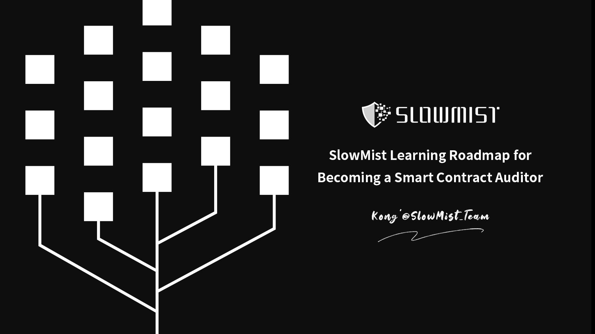
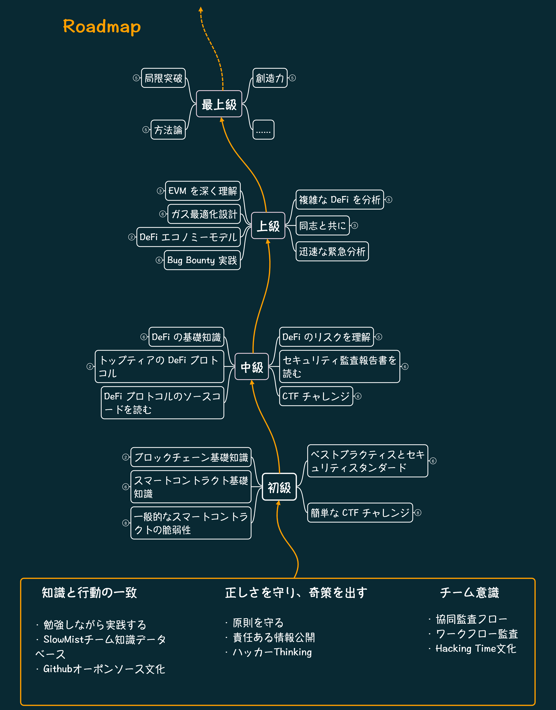

By: [Kong'](https://twitter.com/TycheKong)@SlowMist Security Team

中文版：**[慢雾(SlowMist)智能合约审计技能树](README_CN.md)** 
English version: **[SlowMist Learning Roadmap for Becoming a Smart Contract Auditor](README.md)** 
日本語版：**[スマートコントラクト監査人への道筋](README_JP.md)** 

翻訳者: 
>[Jack Jia](https://x.com/JackJia2021)

⚓️**目次**

- [**概要**](#概要)
- [**ロードマップ**](#ロードマップ)
- [**準備段階**](#準備段階)
    - [**1. 知識と行動の一致**](#1-知識と行動の一致)
    - [**2. 正しさを守り、奇策を出す**](#2-正しさを守り奇策を出す)
    - [**3. チーム意識**](#3-チーム意識)
- [**初級**](#初級)
    - [**1. ブロックチェーンの基礎知識**](#1-ブロックチェーンの基礎知識)
    - [**2. スマートコントラクトの基礎知識**](#2-スマートコントラクトの基礎知識)
    - [**3.一般的なスマートコントラクトの脆弱性**](#3一般的なスマートコントラクトの脆弱性)
    - [**4. ベストプラクティスとセキュリティ基準**](#4-ベストプラクティスとセキュリティ基準)
    - [**5. 簡単なCTFチャレンジ**](#5-簡単なctfチャレンジ)
- [**中級**](#中級)
    - [**1. DeFiの基礎知識**](#1-defiの基礎知識)
    - [**2. 主要DeFiプロトコル**](#2-主要defiプロトコル)
    - [**主要プロトコルのソースコードを深く読む**](#主要プロトコルのソースコードを深く読む)
    - [**4. DeFiのリスクを理解する**](#4-defiのリスクを理解する)
    - [**5. 監査報告書を読む**](#5-監査報告書を読む)
    - [**6. CTFチャレンジ**](#6-ctfチャレンジ)
- [**上級**](#上級)
    - [**1. EVMを深く理解する**](#1-evmを深く理解する)
    - [**2. Gasの最適化設計**](#2-gasの最適化設計)
    - [**3. DeFi経済モデル**](#3-defi経済モデル)
    - [**4. 複雑なDeFiプロトコルの分析**](#4-複雑なdefiプロトコルの分析)
    - [**5. 同志と共に**](#5-同志と共に)
    - [**6. 迅速な緊急分析**](#6-迅速な緊急分析)
    - [**7. バグバウンティ実践**](#7-バグバウンティ実践)
- [最上級](#最上級)
    - [**1. 局限突破**](#1-局限突破)
    - [**2. 方法論**](#2-方法論)
    - [**3. 創造力**](#3-創造力)
- [**謝辞**](#謝辞)

## **概要**
このスキルセットは、SlowMistセキュリティチームのスマートコントラクトセキュリティ監査エンジニアのスキルセットであり、チームメンバーにスマートコントラクトセキュリティ監査に必要なスキルを提示し、研究、創造、エンジニアリングにおける自己進化の思考を育むことを目的としている。

スマートコントラクトセキュリティ監査のスキルは、主に4つの段階に分かれている: 「初級」、「中級」、「上級」、そして「最上級」である。これらは、各段階で習得すべき専門スキルを浅いものから深いものへと順にリストアップしている。しかし、その前に、私たちの知識を強化するためにいくつかの汎用的なスキルを身につける必要がある。この準備段階が、監査の旅のアンカーポイントとなるでしょう。

## **ロードマップ**

## **準備段階**

「刀を研ぐことを怠らない者が、最も効率的に木を切ることができる」と言われるように、正式に出発する前に、自分の思考を鍛えることが必要です。これにより、私たちはより確実な一歩を踏み出し、さらに遠くへ進むことができるでしょう。

#### **1. 知識と行動の一致**

認識と実践は密接に関連しており、理論と実践は一体となるべきである。

- 学習には成果が伴い、その成果は実践に結びつけるべきである。
- [SlowMistセキュリティチームのナレッジベース](https://github.com/slowmist/Knowledge-Base)
- GitHubのオープンソース文化

#### **2. 正しさを守り、奇策を出す**

道徳と法律はセキュリティ専門家の最低限の基準であり、セキュリティ専門家は底線を守りながら、優れた技術を磨き、重要な瞬間に出奇制勝する必要がある。

- 底線を守る
  - 監査者は法律を遵守し、道徳的な最低限の基準を守るべきである。
- 責任ある開示
  - SlowMistの警告プロセス
  - [FIRSTの倫理規範](https://www.first.org/global/sigs/ethics/ethics-first)
- ハッカーThinking
  - セキュリティ専門家は、倫理的な最低限の基準を守りつつ、創造的な方法で問題を解決し、重要な瞬間に優位に立つことが求められている。
  - 「正しさを守り」とは、敬意を持ち、倫理的な最低限の基準を守ることを意味する。
  - 「奇策を出す」とは、創造的な思考を持ち、細心の注意を払い、逆の発想や柔軟な思考を持つことを意味する。

#### **3. チーム意識**

個々の能力には限界があるが、チームでの協力が個人の不足を補う。

- 協同監査フロー
  - SlowMist MistPunk監査ワークベンチでの協同作業を通じて、技術的方法で監査の質を確保し、監査経験を蓄積する。
- 監査ワークフロー
  - SlowMistの監査ワークフローにより、管理手法で監査の質を確保し、監査作業の欠陥を補う。
- Hacking Time文化
  - チームメンバーがいつでもどこでも思考のぶつかり合い、共有することで、チームの能力を整え、全体のスキルを向上させる。

## **初級**

暗号化の世界は、今日までに暗号学、経済学、データサイエンスなどの学問分野を網羅しているである。この広大な知識の世界にどう入り込むかが鍵である。この段階では、Ethereum（イーサリアム）およびそのスマートコントラクト言語であるSolidityを出発点として、暗号資産の世界への入り口を見つけていく

#### **1. ブロックチェーンの基礎知識**

スマートコントラクトが何であるかを理解する前に、スマートコントラクトが動作するブロックチェーンプラットフォームについて理解する必要がある

- [ブロックチェーンとは？](https://www.investopedia.com/terms/b/blockchain.asp)
- [ブロックチェーンの可視化デモ](https://www.youtube.com/watch?v=_160oMzblY8)
- [SlowMistのブロックチェーン基礎知識](https://mp.weixin.qq.com/mp/appmsgalbum?__biz=MzU4ODQ3NTM2OA==&action=getalbum&album_id=1378673890158936067&scene=126#wechat_redirect)
- [暗号資産の仕組み](https://www.bilibili.com/video/BV11x411i72w/)
- [Mastering Bitcoin](https://github.com/inoutcode/bitcoin_book_2nd)
- [Mastering Ethereum](https://github.com/inoutcode/ethereum_book)
  - 第1章、第4章、第5章、第6章、第7章、および第13章を重点的に読むことを推奨する。

#### **2. スマートコントラクトの基礎知識**

異なるブロックチェーンでは、さまざまな言語でスマートコントラクトが構築される。たとえば、Solidity、Move、Rust、Vyper、Cairo、C++などである。現在、EVM互換チェーンで使用されているSolidityは、依然として最も人気があり、入門しやすいスマートコントラクト言語である。この言語のドキュメントを完全に読むことが重要である。また、Ethereum（イーサリアム）上で動作するトークンスマートコントラクトの設計基準と具体的なスマートコントラクト実装について理解する必要がある。これを基に、スマートコントラクトがどのようにアップグレード可能であるかを理解し、スマートコントラクトの作成とテストの実践スキルを身に付けることが求められる。

- [Solidity公式ドキュメント](https://docs.soliditylang.org/en/latest/)
- [Mastering Ethereum](https://github.com/inoutcode/ethereum_book)
  - 残りのすべての章を重点的に読むことが推奨される。
- [Ethereumリクエスト・フォー・コメント（ERC）の基本を理解する  ](https://eips.ethereum.org/erc)
  - [ERC20](https://eips.ethereum.org/EIPS/eip-20) 代替性トークン標準
  - [ERC165](https://eips.ethereum.org/EIPS/eip-165) インターフェース標準
  - [ERC173](https://eips.ethereum.org/EIPS/eip-173) コントラクト所有権標準
  - [ERC191](https://eips.ethereum.org/EIPS/eip-191) データ署名標準
  - [ERC601](https://eips.ethereum.org/EIPS/eip-601) HDウォレットの階層構造標準
  - [ERC721](https://eips.ethereum.org/EIPS/eip-721) HDウォレットの階層構造標準
  - [ERC777](https://eips.ethereum.org/EIPS/eip-777) 互換可能なトークン標準
  - [ERC1155](https://eips.ethereum.org/EIPS/eip-1155) マルチトークン標準
  - [ERC1167](https://eips.ethereum.org/EIPS/eip-1167) ミニマルプロキシコントラクト
  - [ERC1967](https://eips.ethereum.org/EIPS/eip-1967) プロキシデータストレージスロット
  - [ERC2612](https://eips.ethereum.org/EIPS/eip-2612) トークン承認署名
  - [ERC4626](https://eips.ethereum.org/EIPS/eip-4626) トークントレジャリー標準
- [OpenZeppelin Token 実装を学ぶ](https://github.com/OpenZeppelin/openzeppelin-contracts/tree/master/contracts/token)
- アップグレード可能なコントラクト/プロキシコントラクトを理解する
  - [異なるモードのプロキシコントラクト紹介](https://ethereum-blockchain-developer.com/110-upgrade-smart-contracts/00-project/)
  - [異なるプロキシコントラクトのモデル紹介](https://proxies.yacademy.dev/pages/proxies-list/)
  - [OpenZeppelin Proxy 実装ドキュメント](https://docs.openzeppelin.com/contracts/4.x/api/proxy)
- スマートコントラクトの作成を学ぶ
  - [WTF Solidityスマートコントラクトチュートリアル](https://www.wtf.academy/)
  - [Crypto Zombies](https://cryptozombies.io/en/course/)
  - [Smart Contract Engineer](https://www.smartcontract.engineer/)
  - [Solidity by Example](https://solidity-by-example.org/)
- Mastering Ethereum Smart Contract Development
- スマート関連のBuildツール
  - オンラインIDEを使用することを学ぶ
    - [Remix](https://remix.ethereum.org/)
    - [ChainIDE](https://chainide.com/)
    - [Tenderly Sandbox](https://sandbox.tenderly.co/)
  - パッケージマネージャーの使用に慣れること。
    - [npm](https://www.npmjs.com/)
    - [yarn](https://yarnpkg.com/)
    - [pnpm](https://pnpm.io/)
  -  人気のスマートコントラクトテストとデバッグフレームワーク
    - [Foundry](https://book.getfoundry.sh/)
      - [シンプルなテストツール](https://book.getfoundry.sh/forge/tests)
      - [強力なチートコード](https://book.getfoundry.sh/cheatcodes/)
      - [ベストプラクティス](https://book.getfoundry.sh/tutorials/best-practices)
    - [Hardhat](https://hardhat.org/hardhat-runner/docs/getting-started#overview)
      - [強力なプラグインを活用すること](https://hardhat.org/hardhat-runner/plugins)
    - [Brownie](https://eth-brownie.readthedocs.io/en/stable/)
    - [Tenderly](https://tenderly.co/)
      - [簡単な開発テスト環境 DevNet](https://docs.tenderly.co/devnets/intro-to-devnets)
      - [高速トランザクションシミュレーション](https://docs.tenderly.co/simulations-and-forks/intro-to-simulations)
      - [可視化されたトランザクションデバッグツール](https://docs.tenderly.co/debugger/how-to-use-tenderly-debugger)
    - [Sentio](https://app.sentio.xyz/explorer)
      - [コードインデックスを使用してオンラインでデバッグを行う](https://docs.sentio.xyz/sentio-debugger/code-insight)
      - [トランザクションシミュレーション中にコントラクトを上書きする](https://docs.sentio.xyz/sentio-debugger/simulation#override-contract)
  - トランザクションシミュレーション中にコントラクトを上書きする
    - [JSON-RPCを理解する](https://ethereum.org/en/developers/docs/apis/json-rpc/)
    - [ethers.js](https://docs.ethers.org/)
    - [Web3.js](https://web3js.readthedocs.io/)
    - [Web3.py](https://web3py.readthedocs.io/)
    - [viem](https://viem.sh/)

#### **3.一般的なスマートコントラクトの脆弱性**

スマートコントラクトの基礎知識を学び終えた後、その一般的な基礎的脆弱性を理解し、脆弱性の原理を知っておく必要がある。その中で、Quillhashが整理した脆弱性リストは複数の情報源を集約しており、現在よく見られるスマートコントラクトの脆弱性タイプを比較的完全に示している。*(ただし、初心者にとっては、すべてのリストを繰り返し読んで印象を深めることをお勧める。)*

- [DASP Top 10](https://www.dasp.co/)
- [SWCレジストリ](https://swcregistry.io/)
- [スマートコントラクトセキュリティガイド](https://scsfg.io/hackers/)
- [Kaden: スマートコントラクト攻撃ベクトル](https://github.com/kadenzipfel/smart-contract-vulnerabilities)
- [Kaden: スマートコントラクト攻撃ベクトル](https://github.com/Quillhash/Solidity-Attack-Vectors)
- [RareSkills Smart Contract Security](https://www.rareskills.io/post/smart-contract-security)

#### **4. ベストプラクティスとセキュリティ基準**

監査人として、スマートコントラクトのベストプラクティスとセキュリティ基準を理解しておく必要がある。ベストプラクティスは、監査中にセキュリティ問題を見つけるための参考を提供し、セキュリティ基準は、監査で指摘されるセキュリティ問題の根拠となる。

- [Solidity Patterns](https://fravoll.github.io/solidity-patterns/)
- [Solcurity](https://github.com/transmissions11/solcurity)
- [ConsenSysスマートコントラクトのベストプラクティス](https://github.com/ConsenSys/smart-contract-best-practices/blob/master/README-zh.md)
- [Solidityセキュリティの落とし穴とベストプラクティス101](https://secureum.substack.com/p/security-pitfalls-and-best-practices-101)
- [Solidityセキュリティの落とし穴とベストプラクティス201](https://secureum.substack.com/p/security-pitfalls-and-best-practices-201)
- [SCSVSv2](https://github.com/securing/SCSVS/tree/prerelease/SCSVSv2)
- [EEA EthTrust Certification](https://entethalliance.org/specs/ethtrust-sl/)
- [Foundryテストのベストプラクティス](https://book.getfoundry.sh/tutorials/best-practices)

#### **5. 簡単なCTFチャレンジ**

ブロックチェーンとスマートコントラクトの基礎知識、および一般的なスマートコントラクトの脆弱性を学んだ後、いくつかの簡単なCTFチャレンジを通じて、習得した知識を強化し、実践することができる。

- [OpenZeppelin Ethernaut](https://ethernaut.openzeppelin.com/)
- [Capture the Ether](https://capturetheether.com/)

## **中級**

ブロックチェーンとスマートコントラクトの基礎知識を習得した後、私たちはSolidityスマートコントラクトのセキュリティ監査という扉を開いた。その先にあるスマートコントラクトの世界は依然として非常に広大である。この段階では、分散型金融（DeFi）から始めて、その先にあるさらに広範なスマートコントラクトの応用を深く探求していく。

#### **1. DeFiの基礎知識**

ブロックチェーンとスマートコントラクトがDeFiの構築を可能にし、DeFiの出現によってEthereumなどのパブリックチェーンが急速に発展した。さらに深く探求する前に、まずDeFiとは何かを理解しておくべきでしょう。

- 「[How To DeFi: Beginner](https://landing.coingecko.com/how-to-defi/)」 を読む
- 「[How To DeFi: Advanced](https://landing.coingecko.com/how-to-defi/)」 を読む
- [DeFiの各タイプの紹介](https://teachyourselfcrypto.com/#ftoc-module-4-decentralized-finance-defi)
  - 各タイプのDeFiとは何かを理解する
  - 基本的な経済学の知識とよく使われる用語を理解する
- [基本的な金融の遊び方*の紹介](https://www.khanacademy.org/economics-finance-domain/core-finance/derivative-securities)
- [経済モデル101](https://tokenomicsdao.xyz/tokenomics101/)

#### **2. 主要DeFiプロトコル**

DeFiとは何かを初步的に理解した後、さらにそれらが何を実現しているのか、どのように実現されているのかを学ぶべきである。現在の主要なDeFiプロトコルの技術ドキュメントを読むことで、トップレベルのDeFiプロトコルがどのように実現されているかを初步的に理解できる。

- [MakerDAO](https://docs.makerdao.com/) (CDP)
- [AAVE](https://docs.aave.com/hub/) (Lending)
  - [V2](https://docs.aave.com/developers/v/2.0/)
  - [V3](https://docs.aave.com/developers/getting-started/readme)
- Compound (Lending)
  - [V2](https://docs.compound.finance/v2/)
  - [V3](https://docs.compound.finance/)
- Uniswap (DEX)
  - [V2](https://docs.uniswap.org/contracts/v2/overview)
  - [V3](https://docs.uniswap.org/contracts/v3/overview)
- Curve (DEX)
  - [技術ドキュメント](https://docs.curve.fi/)
  - [アルゴリズム概要](https://hackmd.io/@alltold/curve-magic)
  - [Curve ニュートン反復の詳細](https://0xreviews.xyz/posts/2022-02-28-curve-newton-method)
- Chainlink (Oracle)
  - [価格オラクル](https://docs.chain.link/data-feeds)
  - [VRF](https://docs.chain.link/vrf/v2/introduction)
- Convex Finance (Yield)
  - [プロトコル紹介](https://docs.convexfinance.com/convexfinance/)
  - [技術ドキュメント](https://docs.convexfinance.com/convexfinanceintegration/)
- [Yearn Finance](https://docs.yearn.fi/getting-started/intro) (Yield Aggregator)
- [GMX](https://gmxio.gitbook.io/gmx/) (Derivatives)
- [Nexus Mutual](https://docs.nexusmutual.io/overview/) (Insurance)
- [OpenSea](https://github.com/ProjectOpenSea/seaport#seaport) (NFT Marketplace)
- [Set Protocol](https://docs.tokensets.com/) (Indexes)
- [Lido](https://docs.lido.fi/) (Liquid Staking)
- ...

#### **主要プロトコルのソースコードを深く読む**

現在、多くのDeFiプロジェクトが相互に依存し、組み合わされており、いくつかの主要なDeFiプロトコルがDeFiの組み合わせの基盤となる構成要素となっている。そのため、これらのDeFiの実装を把握することは非常に重要である。以前にプロトコルの技術ドキュメントを通じてDeFiの実装を初步的に理解した後、次に全量のソースコードを読むことで、その具体的なロジックや経済モデルを習得する。

#### **4. DeFiのリスクを理解する**

DeFiはスマートコントラクトに限定されるものではなく、フロントエンドとバックエンドもその重要な構成要素である。ほとんどのユーザーはフロントエンドを通じてDeFiとやり取りを行い。そのため、DeFiの仕組みと実装を理解した後、フロントエンドのセキュリティ実践、バックエンドのセキュリティ設定要件、そしてDeFiの過去の脆弱性を基に、そのリスクについて学び、実践することが重要である。

- Webフロントエンドセキュリティを理解する
  - SlowMist Webフロントエンドベストセキュリティプラクティスガイド
  - 『Webフロントエンドハッキング技術の解明』をもっと学ぶ
- DeFiがハッキングされた原因を理解する
  - [SlowMistのDeFiハッキング簡易分析](https://docs.google.com/document/d/1b-uHJ7XDe1-xyaQQ9MYB3FGmYD7K_ULH8bUc20EZfu8/edit)
  - [SlowMist Medium](https://slowmist.medium.com/)
  - [DeFiHackLabs](https://web3sec.notion.site/web3sec/Web3-Security-ddaa8bf9a985494dbaf70d698345b899)
  - [Rekt](https://rekt.news/zh/)
  - [Immunefi](https://medium.com/@immunefi)
  - [QuillAudits](https://quillaudits.medium.com/)
  - [BlockSec](https://blocksecteam.medium.com/)
  - [Neptune Mutual](https://medium.com/@neptunemutual)
  - [PeckShield](https://twitter.com/peckshield)
  - [hacxyk](https://medium.com/@hacxyk)
  - [TrailOfBits](https://blog.trailofbits.com/)
  - [Secureum](https://secureum.substack.com/)
  - [Openzeppelin](https://blog.openzeppelin.com/security-audits/)
  - [OfferCIA](https://officercia.mirror.xyz/)

#### **5. 監査報告書を読む**

監査を行う際、個人の視点ではどうしても見落としがあり、すべての状況を網羅することはできない。そのため、他人の監査報告書を読むことで、異なる脆弱性の発見方法や監査の思考法を学ぶことが重要である。

- [SlowMist Audit Reports](https://github.com/slowmist/Knowledge-Base)
- [Solodit Aggregation](https://solodit.xyz/)
- [Code4rena Audit Reports](https://code4rena.com/reports)
- [Consensys Audit Reports](https://consensys.net/diligence/audits/)
- [QuillAudits Audit Reports](https://github.com/Quillhash/QuillAudit_Reports)
- [Spearbit Audit Reports](https://github.com/spearbit/portfolio/tree/master/pdfs)
- [Sherlock Audit Reports](https://github.com/sherlock-protocol/sherlock-reports)
- [ADBK Audit Reports](https://github.com/abdk-consulting/audits)
- [BlockSec Audit Reports](https://github.com/blocksecteam/audit-reports)
- [Certik Audit Reports](https://www.certik.com)
- [ChainSecurity Audit Reports](https://chainsecurity.com/smart-contract-audit-reports/)
- [Cyfrin Audit Reports](https://github.com/Cyfrin/cyfrin-audit-reports)
- [PeckShield Audit Reports](https://github.com/peckshield/publications)
- [OpenZeppelin Audit Reports](https://blog.openzeppelin.com/tag/security-audits)
- [Complete List of Security Audit Reports](https://github.com/0xNazgul/Blockchain-Security-Audit-List)

#### **6. CTFチャレンジ**

難易度の高いCTFチャレンジに取り組むことで、知識を強化し、実践に活かすことができる。

- [EtherHack](https://etherhack.positive.com/)
- [SI Blockchain CTF](https://blockchain-ctf.securityinnovation.com/)
- [QuillCTF](https://www.quillaudits.com/academy/ctf)
- [Curta CTF](https://www.curta.wtf/)
- [Paradigm CTF](https://ctf.paradigm.xyz/)
- [Cipher Shastra CTF](https://ciphershastra.com/index.html)
- [Damn Vulnerable DeFi](https://www.damnvulnerabledefi.xyz/)
- [unhackedctf](https://github.com/unhackedctf)

## **上級**

主要なDeFiの探求過程を通じて、DeFiに対する深い理解を築き上げる。次に、底層のEVMからDeFiの上層経済モデルに至る学習を通じて、スマートコントラクトへの理解をさらに深めていく。そしてこの過程で、複雑なスマートコントラクトを独立して監査することで、独自の監査方法論を確立することができる。

#### **1. EVMを深く理解する**

EVMはスマートコントラクトの命令を実行する役割を担っており、EVMを深く理解することで、スマートコントラクトのデプロイ、呼び出し、実行、データストレージに対する理解をより深めることができる。同時に、Gas最適化や脆弱性発見のための基盤を築くことにも役立つ。

- [EVMについて](https://www.evm.codes/about)
- [The EVM From Scratch Book](https://evm-from-scratch.xyz/intro)
- [Noxx EVM深掘り](https://noxx.substack.com/p/evm-deep-dives-the-path-to-shadowy)
- [Solidityスロットデータ解析](https://ethdebug.github.io/solidity-data-representation/)
- [Ethereumイエローペーパー](https://ethereum.github.io/yellowpaper/paper.pdf)
  - [簡易版](https://github.com/chronaeon/beigepaper)
- [Quillhash EVM Mastery](https://github.com/Quillhash/EVM-Mastery)
- [EVMの実装例](https://github.com/noxx3xxon/evm-by-example)

#### **2. Gasの最適化設計**

オンチェーンでのトランザクションの実行にはすべてGasコストがかかる。複雑なコントラクトの場合、Gasを最適化することでユーザーのインタラクションコストを下げ、ユーザーを引きつけることができる。そのため、監査員にはGas最適化設計について一定の理解が求められる。

- [Gas 最適化参考 1](https://www.alchemy.com/overviews/solidity-gas-optimization)
- [Gas 最適化参考 2](https://www.rareskills.io/post/gas-optimization)
- [Gas 最適化参考 3](https://coinsbench.com/structs-in-solidity-best-practices-for-gas-efficiency-by-0xlazard-4e984a7485cf)

#### **3. DeFi経済モデル**

経済モデルはDeFi製品の核心部分であるため、経済モデルのリスクを理解することは非常に重要である。学習の過程で、独自の見解と方法論を確立していくべく。

- [ガバナンスリスク](https://arxiv.org/abs/2308.04267)
- [DeFi経済モデルリスクのまとめ](https://github.com/engn33r/DeFi-Risk-Modelling-Awesome)
  - [Euler Oracle Manipulation Tool](https://oracle.euler.finance/)
  - [Chaos Lab Uniswap v3 Oracle Manipulation Risk](https://community.chaoslabs.xyz/uniswap/twap)
  - [Agent Buttercup simulation engine](https://github.com/Cozy-Finance/agent-buttercup)
  - [Curve simulation tool](https://github.com/curveresearch/curvesim)
  - [DELV agent-based simulation tool](https://github.com/delvtech/elf-simulations)
  - Uniswap v3 simulator[ option 1](https://github.com/Bella-DeFinTech/uniswap-v3-simulator),[ option 2](https://github.com/aloelabs/uniswap-simulator),[ option 3](https://github.com/DefiLab-xyz/uniswap-v3-simulator)

#### **4. 複雑なDeFiプロトコルの分析**

これらのスキルを統合し、熟練した後、監査員は複雑で独創性の高いDeFiプロトコルを分解し分析する能力を持つべきく。

#### **5. 同志と共に**

他の優れた仲間が研究している内容を学ぶことで、私たちにより多くのインスピレーションを得られ、視野を広げることができる。

- [Bytes032](https://blog.bytes032.xyz/)
- [Noxx](https://noxx.substack.com/)
- [Mixbytes](https://mixbytes.io/blog/)
- [Samczsun](https://samczsun.com/research/)
- [Cmichel](https://cmichel.io/)
- [Pessimistic](https://blog.pessimistic.io/)
- [OfficerCia](https://officercia.mirror.xyz/)
- [Smart Contract Research Forum](https://www.smartcontractresearch.org/)
- [Zefram](https://zefram.xyz/posts/)
- [Alin Tomescu](https://alinush.github.io/)
- [Christoph Michel](https://cmichel.io/)
- [Kyrian Alex](https://kyrianalex.substack.com/)
- ...

#### **6. 迅速な緊急分析**

十分な数の複雑なプロジェクトを独立して監査し、さまざまなビジネスシナリオを経験し、多くの知識を蓄積した後、私たちは突発的なセキュリティインシデントに迅速に対応し、迅速な分析とアウトプットを行うことができるようになる。以下は、いくつかの一般的に使用される分析ツールである：

- コントラクト逆コンパイルツール
  - [Dedaub](https://library.dedaub.com/decompile)
  - [Panoramix](https://github.com/palkeo/panoramix)
  - [abi-decompiler](https://github.com/Decurity/abi-decompiler)
  - [heimdall-rs](https://github.com/Jon-Becker/heimdall-rs)
  - [ethervm](https://ethervm.io/decompile)
  - [Pyevmasm](https://github.com/crytic/pyevmasm)
- トランザクション分析ツール
  - [Phalcon](https://explorer.phalcon.xyz/)
  - [ethtx.info](https://ethtx.info/)
  - [Tx eth samczsun](https://tx.eth.samczsun.com/)
  - [Tenderly](https://tenderly.co/)
  - [Sentio](https://app.sentio.xyz/explorer)
  - [Eigenphi](https://eigenphi.io/)
  - [SocketScan](https://socketscan.io/)
- その他のツール
  - [Web3 Security Tools](https://github.com/Quillhash/Web3-Security-Tools)
  - [On Chain Investigations Tools List](https://github.com/OffcierCia/On-Chain-Investigations-Tools-List)

#### **7. バグバウンティ実践**

実践を行い、最も現実的なシナリオで能力を検証する。

- [Immunefi](https://immunefi.com)
- [BugRap](https://bugrap.io)
- [Code4rena](https://code4rena.com)
- [HackerOne](https://hackerone.com)
- [HackenProof](https://hackenproof.com)
- [HatsFinance](https://hats.finance/)
- ...

## 最上級

Solidityスマートコントラクトを通じて入り口を見つけた後、単一の分野でぐるぐる回ることに満足するのではなく、独自の方法論を確立し、大胆に新しい扉を切り開いて飛び出し、現在の分野を深く掘り下げつつ、他の分野にも手を広げるべきく。

#### **1. 局限突破**

Solidityスマートコントラクトの入門を終えた後、それに限定せず、他のタイプや言語にも視野を広げ、それらに関連する監査方法についても知識を深めるべきく。

- Solidityに限定せず、Rust、Vyper、Cairo、Moveなどのスマートコントラクト言語についても理解しておくべく。  
- スマートコントラクトに限定せず、BTC、Cosmos、Solana、Starknet、EVM L2など、他の人気のパブリックチェーンについても理解しておくべきく。  
- ブロックチェーンに限定せず、Web2.0やモバイル端末などについても理解しておくべきく。  
- 暗号学の分野を深く理解する。
- ...

##### ブレークスルーと蓄積

以下の SlowMist の一部公開済みの蓄積内容:

- [ブロックチェーンに基づく暗号資産のセキュリティ監査ガイドライン](https://github.com/slowmist/Cryptocurrency-Security-Audit-Guide/blob/main/README_JP.md)
- [Web3プロジェクトのセキュリティベストプラクティス要件](https://github.com/slowmist/Web3-Project-Security-Practice-Requirements/blob/main/README_ja_JP.md)
- モバイル向けセキュリティ監査ナレッジベース
- [EOSスマートコントラクトの安全な開発ベストプラクティス](https://github.com/slowmist/eos-smart-contract-security-best-practices/blob/master/README_EN.md)
- [Solanaスマートコントラクトのセキュリティベストプラクティス](https://github.com/slowmist/solana-smart-contract-security-best-practices)
- [APTOS MOVEスマートコントラクト監査入門](https://github.com/slowmist/APTOS-MOVE-Smart-Contract-Auditing-Primer)
- [zk-SNARK Groth16 詳解](https://github.com/slowmist/zkSnark-Groth16-Getting-Started)
- [Cairo 0 セキュリティ監査ベストプラクティス](https://github.com/slowmist/Cairo0-Security-Audit-Practice-Guide)
- [アカウントアブストラクションのセキュリティ監査チェックリスト](https://github.com/slowmist/Account-Abstraction-Security-Audit-Checklist)
- [初めてのTON：アカウント、トークン、トランザクション、および資産のセキュリティ](https://mp.weixin.qq.com/s/ElLcWlp6BCWhq1z6K3a1vw)
- [Toncoinスマートコントラクトのセキュリティベストプラクティス](https://github.com/slowmist/Toncoin-Smart-Contract-Security-Best-Practices)
- [Suiの深掘り：高性能を支える技術とスマートコントラクトのセキュリティ](https://mp.weixin.qq.com/s/OApdZkZVfh4WohOq4X1sgg)
- ...

#### **2. 方法論**

スマートコントラクトのセキュリティ監査スキルを統合し、熟練した後、独自の方法論を確立することができる。これにより、問題の核心に迅速にたどり着き、解決策を見極めることが可能になります。優れた方法論は、私たちの効率を倍増させてくれる。

- 監査業務に対する方法論  
- スマートコントラクトのセキュリティ実践に対する方法論  
- 物事を行うための方法論  
- 思考体系を構築するための方法論

#### **3. 創造力**

創造力は私たちが敵を打ち負かし、勝利を収めるための切り札であり、前進し続けるために必要なものである。スキルを段階的に習得した後、さらに私たちの思考を強化することで、より遠くまで進むことができるようになる。

- 好奇心を保つ
 - 新しい物事に対する敏感さ
 - 自分の領域や専門、職業に限定されないこと
- 知識を追い求める
 - 知識に対する敬意を保つ
 - 新しい知識を探求する  
- ハッカーThinking
 - ハッカーとは精神や思考法でもあり、正しさを守りつつ奇策を出すこと  
- 研究に長ける
 - 研究を行う際には、実際の成果やドキュメントとしてアウトプットするべき  
- エンジニアリング化
 - 優れたアイデアや研究成果をエンジニアリング化し、実践で検証することに長ける
  - SlowMist MistEye Monitoring System
  - SlowMist Contract Visibility Analysis Tool
  - SlowMist Static Vulnerability Scanner

## **謝辞**

本文に対して貴重な意見をいただいた友人たちに感謝する。

- [Cos](https://twitter.com/evilcos)
- [23pds](https://twitter.com/IM_23pds)
- [T41nk](https://twitter.com/T41nk_)
- Doublenine
- Flush
- Blue
- Lizi

また、英文版の翻訳作業を担当してくれたJianさん、そしてカバーイラストを提供してくれたHik3さん、日本語版の記事の専門的な翻訳を担当してくれたJackさんにも感謝する。
